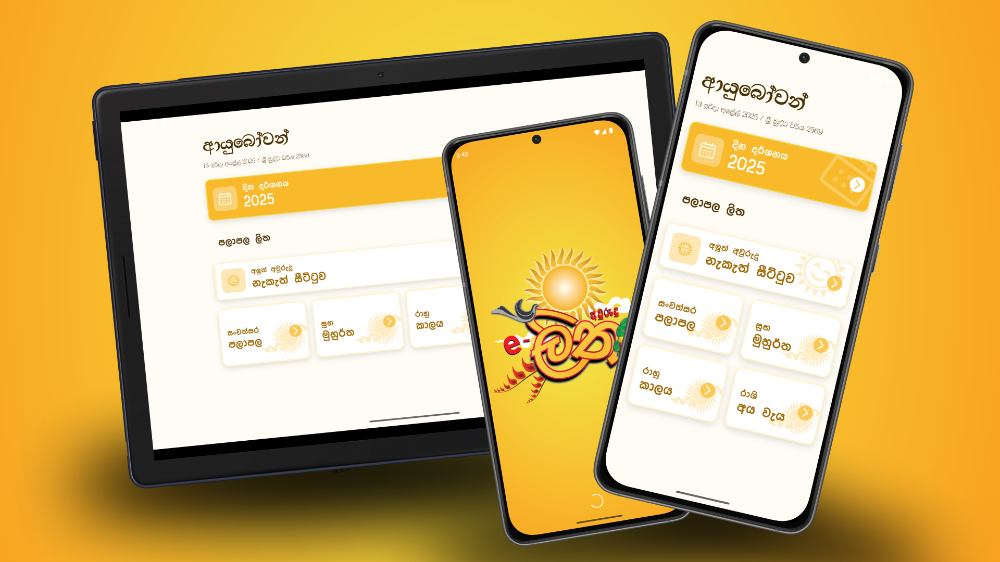

# E-Avurudu Litha

E-Litha is a localized Sri Lankan **Avurudu Litha** mobile application built using Flutter. It functions as a modern, digital version of the traditional printed Litha, providing important cultural and religious dates, holidays, and Nakath times.



## 🌐 Localized for Sri Lanka
- Dates and times are adapted to the Sri Lankan calendar and cultural practices.
- Features unique Avurudu events, public holidays, and Nakath timings relevant to local traditions.

## ✨ Features
- **Online Avurudu Litha**: Modern digital replacement for the traditional paper-based Litha.
- **Automatic Notifications**:
  - Special date alerts
  - Holiday reminders
  - Nakath notifications (including 1 hour prior reminders)
- **Offline View**: Users can view information offline.

## ⚡ Getting Started

### Requirements
- Flutter SDK
- Android Studio or VS Code

### Installation
```bash
git clone https://github.com/DilharaSannasgala/E-Litha-Flutter-App.git
cd E-Litha-Flutter-App-main
flutter pub get
flutter run
```

### 📦 Download APK
[Download Latest APK](https://mega.nz/file/GjQF3D4b#esTHRtjHuF6OUtrCzr-3T8ccb09Aq5UgZCPTW-94o1Y)

